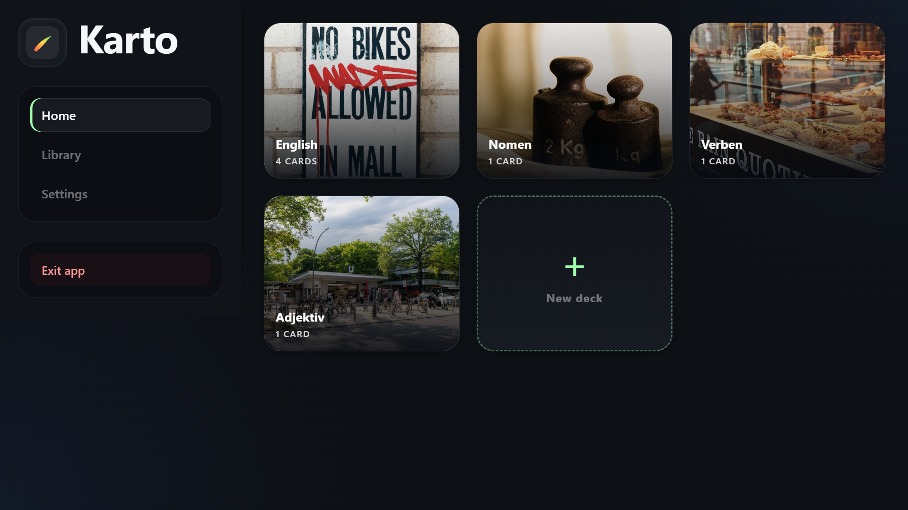
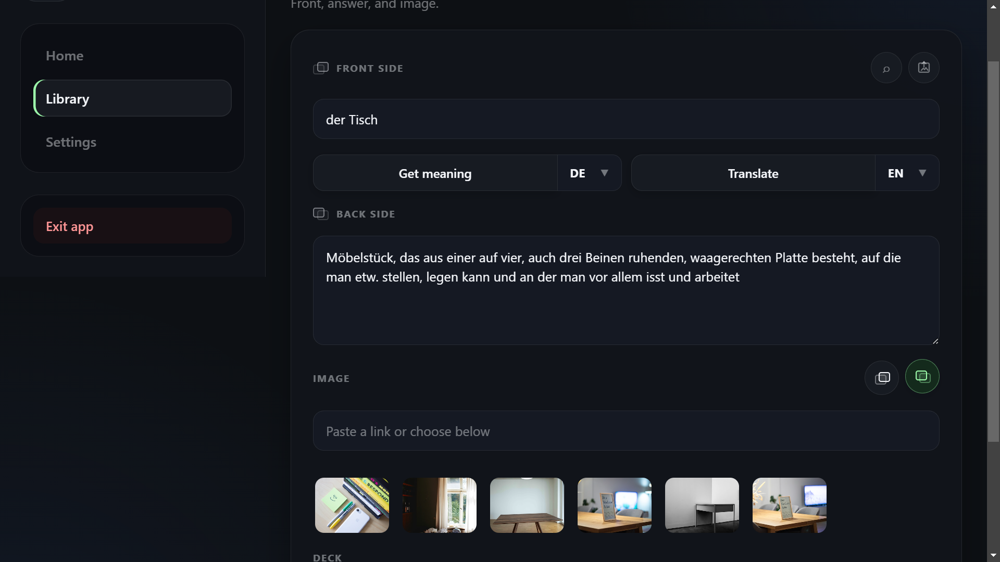
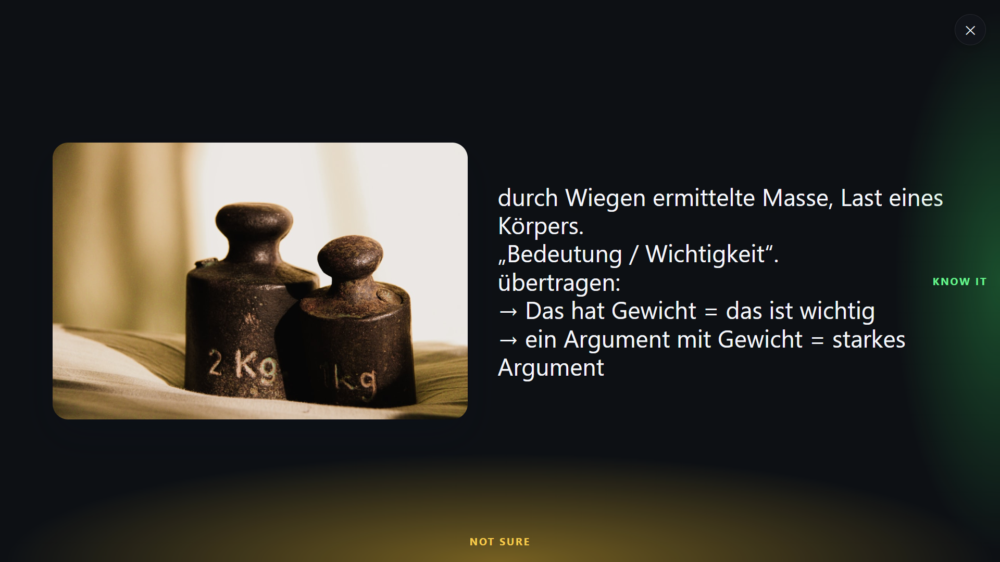

# Karto

[](https://github.com/batonchikhiphopa/Karto/actions/workflows/ci.yml)

Karto is a local-first desktop flashcard app for focused study. Build decks, add text and images, look up definitions or translations, and review with a keyboard-friendly study mode — without creating an account or sending your library to a cloud service.

Your decks, progress, sessions, and settings live on your device in SQLite. Online helpers such as image search and translation are optional.


## Download / Run

Download packaged builds from [GitHub Releases](https://github.com/batonchikhiphopa/Karto/releases).

For development:

```bash
git clone https://github.com/batonchikhiphopa/Karto.git
cd Karto
npm install
npm start
```

Karto runs as an Electron desktop app with an embedded local lookup API.

## Why Karto

- **Local-first by default**: SQLite storage on your machine, no account required.
- **Fast card creation**: front/back text, image URL or upload, image search, dictionary definitions, and translations.
- **Focused study mode**: large card display, keyboard controls, three answer ratings, and session summaries.
- **Language-learning helpers**: multilingual UI and optional German article auto-insert for nouns.
- **Portable backups**: import/export decks as JSON, with CSV export for individual decks.
- **Desktop polish**: startup verification, window preferences, offline-friendly core workflow, and packaged builds.

## Screenshots

### Home

Your decks start immediately, with visual tiles and a quick create action.



### Card Editor

Create useful cards quickly with definitions, translations, images, and deck selection in one flow.



### Study Mode

Review in a distraction-light fullscreen experience with keyboard and edge controls.



## Privacy

Karto keeps the core learning data local:

- decks and cards
- study progress
- recent study sessions
- UI settings
- desktop preferences

Optional online integrations call third-party services only when you use the related feature. See [PRIVACY.md](PRIVACY.md) for details.

## Configuration

Create a `.env` file in the project root only if you want optional online integrations:

```env
# Optional: enables Unsplash image search
UNSPLASH_ACCESS_KEY=your_unsplash_key_here

# Optional: enables DeepL translation requests
DEEPL_API_KEY=your_deepl_key_here

# Optional overrides for the embedded local API server
HOST=127.0.0.1
PORT=3000
```

Without API keys, the desktop app still works. Only the related lookup features are disabled.

## Development

Requirements:

- [Node.js](https://nodejs.org/) 18 or newer

Commands:

```bash
npm start          # Launch the desktop app
npm run lint       # Static quality checks
npm test           # Unit/integration tests
npm run test:e2e   # Electron smoke tests
npm run audit      # Production dependency audit
npm run test:all   # Full local quality gate
```

## Build And Distribution

```bash
npm run build
npm run build:win
npm run build:mac
npm run build:linux
```

Generated installers and unpacked bundles are written to `dist/`.

Release practice:

- Commit source, tests, icons, screenshots, and build configuration.
- Do not commit `dist/`, unpacked Electron bundles, installers, `.env`, or local databases.
- Publish generated `.exe`, `.dmg`, and Linux artifacts through GitHub Releases.
- Run `npm run test:all` before tagging a release.

## Project Structure

```text
Karto/
├── app.js
├── index.html
├── main.js
├── preload.js
├── server.js
├── css/
├── js/
│   ├── main/
│   ├── server/
│   ├── ui/
│   └── views/
├── tests/
│   └── e2e/
├── docs/
│   └── screenshots/
└── scripts/
```

## Security

Karto uses Electron with `nodeIntegration: false`, `contextIsolation: true`, sandboxing, a Content Security Policy, and guarded desktop APIs exposed through preload. See [SECURITY.md](SECURITY.md) for reporting and local security notes.

## Changelog

See [CHANGELOG.md](CHANGELOG.md).

## License

MIT
